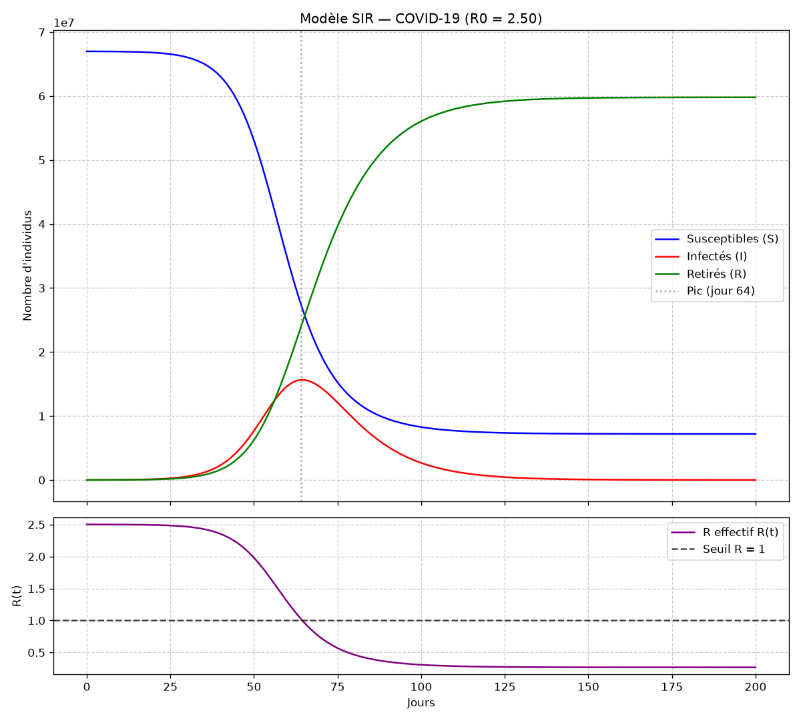
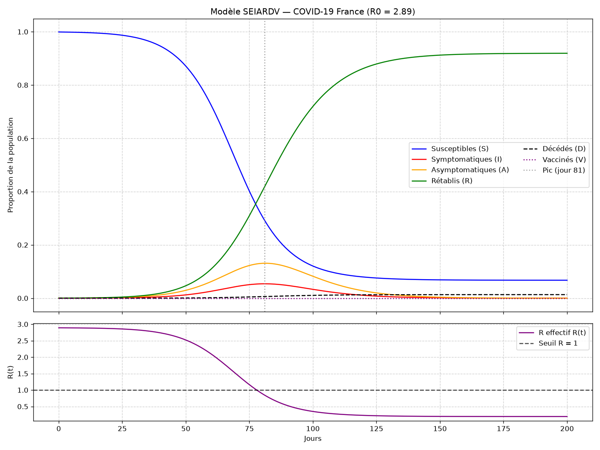
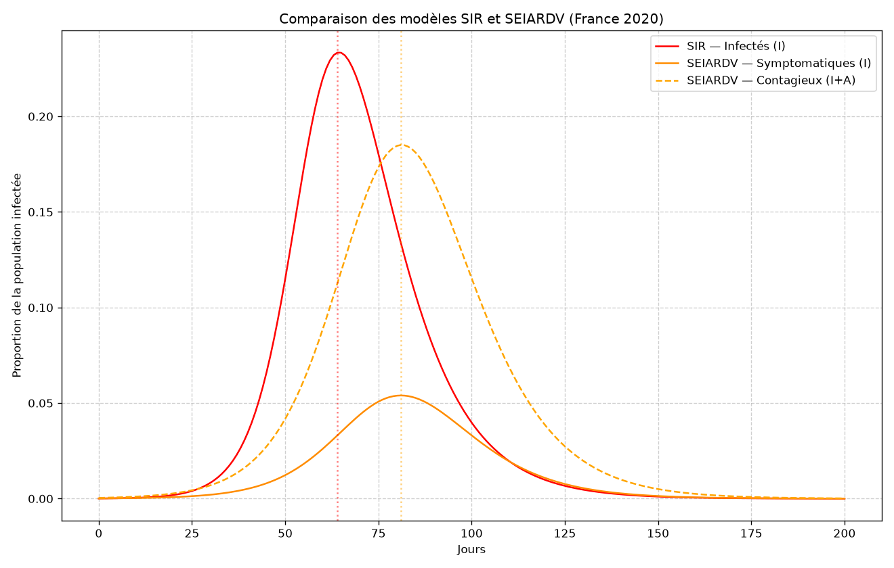
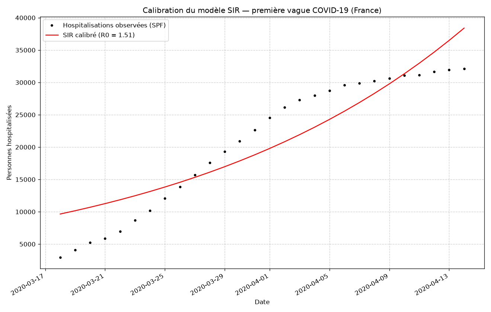

# Modélisation dynamique de la COVID-19 en France métropolitaine — Modèles SIR & SEIARDV

Ce projet simule la dynamique de l'épidémie de COVID-19 en France métropolitaine
à l'aide de deux modèles à compartiments, les compare entre eux et les confronte
aux **données réelles** de Santé Publique France.

- **SIR** — modèle compartimental classique à 3 états (Susceptibles, Infectés, Retirés).
- **SEIARDV** — extension à 7 états intégrant l'incubation, les porteurs
  asymptomatiques, la mortalité et la vaccination.

L'accent est mis sur la **rigueur mathématique** : nombre de reproduction de base
calculé par la matrice de prochaine génération, seuil d'immunité collective,
nombre de reproduction effectif R(t), taille finale d'épidémie et calibration aux
données observées par moindres carrés.

---

## Sommaire

1. [Structure du projet](#structure-du-projet)
2. [Installation](#installation)
3. [Utilisation](#utilisation)
4. [Les modèles mathématiques](#les-modèles-mathématiques)
   - [Modèle SIR](#modèle-sir)
   - [Modèle SEIARDV](#modèle-seiardv)
   - [Nombre de reproduction de base R₀](#nombre-de-reproduction-de-base-r0)
   - [Seuil d'immunité collective](#seuil-dimmunité-collective)
   - [Reproduction effective R(t)](#reproduction-effective-rt)
   - [Taille finale de l'épidémie](#taille-finale-de-lépidémie)
5. [Calibration sur données réelles](#calibration-sur-données-réelles)
6. [Résultats](#résultats)
7. [Limites des modèles](#limites-des-modèles)
8. [Sources des données](#sources-des-données)

---

## Structure du projet

```
COVID-SIR/
├── models.py          # Cœur scientifique : EDO + outils mathématiques (R0, R(t), pic, taille finale)
├── parametres.py      # Paramètres calibrés (dataclasses) + preset « France 2020 »
├── donnees.py         # Téléchargement / cache des données réelles COVID France
├── SIR.py             # Simulation du modèle SIR (saisie manuelle ou preset)
├── SEIARDV.py         # Simulation du modèle SEIARDV
├── comparaison.py     # Comparaison SIR vs SEIARDV
├── calibration.py     # Ajustement du modèle aux données réelles (moindres carrés)
├── requirements.txt   # Dépendances Python
├── data/              # Données réelles mises en cache (CSV national)
└── figures/           # Graphiques générés (PNG)
```

L'architecture sépare le **cœur scientifique** (`models.py`, `parametres.py`),
réutilisable et testable, des **scripts exécutables** qui l'orchestrent.

## Installation

Nécessite **Python 3.10+**.

```bash
pip install -r requirements.txt
```

Dépendances : `numpy`, `scipy`, `matplotlib`, `pandas`, `requests`.

## Utilisation

| Commande | Description |
|----------|-------------|
| `python SIR.py` | Modèle SIR — au choix : saisie manuelle des paramètres **ou** preset France 2020. |
| `python SEIARDV.py` | Modèle SEIARDV avec le preset France 2020. |
| `python comparaison.py` | Compare les deux modèles (graphique + tableau récapitulatif). |
| `python donnees.py` | Télécharge et met en cache les données réelles COVID France. |
| `python calibration.py` | Ajuste le modèle SIR aux hospitalisations réelles (première vague). |

Chaque script affiche un graphique **et** l'enregistre dans `figures/`.

---

## Les modèles mathématiques

### Modèle SIR

La population est répartie en trois compartiments dont la somme `N = S + I + R`
est constante :

```
dS/dt = -β·S·I/N
dI/dt =  β·S·I/N - γ·I
dR/dt =  γ·I
```

- **β** : taux de transmission (contacts infectants par individu et par jour) ;
- **γ** : taux de retrait, inverse de la durée moyenne d'infection (`1/γ` jours).

### Modèle SEIARDV

Sept compartiments : **S**usceptibles, **E**xposés (en incubation, non
contagieux), **I**nfectés symptomatiques, **A**symptomatiques, **R**établis,
**V**accinés, **D**écédés. La force d'infection s'écrit
`λ = (β_I·I + β_A·A) / N(t)`.

```
dS/dt = -λ·S - δ·S
dE/dt =  λ·S - σ·E
dI/dt =  p·σ·E - (γ_I + α)·I
dA/dt = (1-p)·σ·E - γ_A·A
dR/dt =  γ_I·I + γ_A·A
dV/dt =  δ·S
dD/dt =  α·I
```

| Paramètre | Signification | Valeur (France 2020) |
|-----------|---------------|----------------------|
| β_I, β_A | Transmission symptomatiques / asymptomatiques | 0,40 / 0,25 |
| σ | Taux de sortie d'incubation (`1/5,2` j) | 0,192 |
| p | Proportion devenant symptomatique | 0,30 |
| γ_I, γ_A | Taux de guérison | 0,10 / 0,10 |
| α | Mortalité des symptomatiques | 0,005 |
| δ | Taux de vaccination | 0 (1ʳᵉ vague) |

### Nombre de reproduction de base R₀

**SIR.** Directement `R₀ = β / γ`.

**SEIARDV.** Calculé par la **matrice de prochaine génération** (méthode de van
den Driessche & Watmough, 2002). On linéarise le sous-système des compartiments
infectés `(E, I, A)` autour de l'équilibre sans maladie et on l'écrit sous la
forme `x' = (F − V)·x`, où **F** décrit les *nouvelles infections* et **V** les
*transferts* :

```
        ⎡ 0   β_I  β_A ⎤            ⎡  σ        0       0   ⎤
   F =  ⎢ 0    0    0  ⎥      V =   ⎢ -p·σ   γ_I+α     0   ⎥
        ⎣ 0    0    0  ⎦            ⎣ -(1-p)·σ  0      γ_A  ⎦
```

R₀ est le **rayon spectral** de la matrice de prochaine génération `K = F·V⁻¹`,
ce qui donne la formule fermée :

```
R₀ = p · β_I/(γ_I + α) + (1 - p) · β_A/γ_A
```

Le code calcule les deux (rayon spectral **et** formule analytique) et vérifie
qu'ils coïncident (≈ **2,89** pour le preset France). Voir
[`r0_seiardv`](models.py).

### Seuil d'immunité collective

Fraction de la population qui doit être immunisée pour stopper la propagation :

```
seuil = 1 - 1/R₀
```

Soit **60 %** pour le SIR (R₀ = 2,5) et **65 %** pour le SEIARDV (R₀ = 2,89).

### Reproduction effective R(t)

Le R₀ suppose une population entièrement susceptible. Au cours de l'épidémie, le
nombre de reproduction **effectif** décroît à mesure que S diminue :

```
R(t) = R₀ · S(t) / N
```

L'épidémie reflue lorsque `R(t) < 1`. Cette courbe est tracée sous chaque
simulation.

### Taille finale de l'épidémie

Pour le SIR, la proportion totale d'individus finalement infectés `R∞` est
solution de l'équation transcendante (« final size relation ») :

```
R∞ = 1 - exp(-R₀ · R∞)
```

résolue numériquement par la méthode de Brent. Pour le preset France
(R₀ = 2,5), **89 %** de la population est infectée *in fine* en l'absence
d'intervention — ce qui illustre la nécessité des mesures de contrôle.

---

## Calibration sur données réelles

`calibration.py` confronte le modèle aux **hospitalisations** réelles publiées
par Santé Publique France. On suppose `hospitalisés(t) ≈ k · I(t)` et on estime
**β** et le facteur d'observation **k** par moindres carrés
(`scipy.optimize.least_squares`).

La calibration porte sur la **phase de croissance** de la première vague
(18 mars → 14 avril 2020) : un SIR à β constant ne peut représenter que la montée
exponentielle, pas le reflux provoqué par le confinement. Estimer R₀ sur la
croissance initiale est l'approche épidémiologique standard.

> **Remarque.** Les hospitalisations de mars-avril 2020 reflètent déjà l'effet du
> confinement (17 mars). Le R₀ ainsi estimé (≈ 1,5) correspond donc au nombre de
> reproduction **effectif sous confinement**, inférieur au R₀ « pré-confinement »
> (≈ 3) de la souche initiale.

## Résultats

| Figure | Description |
|--------|-------------|
|  | Dynamique S/I/R et R(t) — preset France. |
|  | Dynamique des 7 compartiments et R(t). |
|  | Courbes d'infectés des deux modèles superposées. |
|  | Modèle SIR calibré vs hospitalisations réelles. |

Synthèse comparative (preset France 2020) :

| Indicateur | SIR | SEIARDV |
|------------|-----|---------|
| R₀ | 2,50 | 2,89 |
| Seuil d'immunité collective | 60 % | 65 % |
| Jour du pic | ≈ 64 | ≈ 81 |
| Part totale infectée | 89 % | 93 % |

Le SEIARDV, plus réaliste, retarde le pic (incubation) et infecte une part plus
grande de la population (contribution des asymptomatiques), tout en quantifiant
les décès.

## Limites des modèles

- **β constant** : ignore les confinements, gestes barrières et variations
  saisonnières — d'où l'écart visible sur la figure de calibration.
- **Population homogène et bien mélangée** : pas de structure d'âge ni
  géographique.
- **Paramètres calibrés à la main** : valeurs plausibles mais non issues d'une
  inférence bayésienne complète.
- **Modèle déterministe** : pas de prise en compte de la stochasticité aux faibles
  effectifs.

## Sources des données

- **Santé Publique France** — *Données hospitalières relatives à l'épidémie de
  COVID-19* (`donnees-hospitalieres-covid19`), publié sur
  [data.gouv.fr](https://www.data.gouv.fr/fr/datasets/donnees-hospitalieres-relatives-a-lepidemie-de-covid-19/).
- Paramètres épidémiques inspirés notamment de Salje et al., *Estimating the
  burden of SARS-CoV-2 in France*, **Science** (2020).
